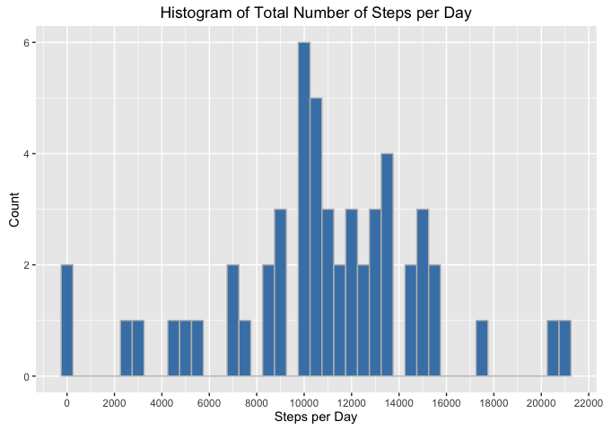
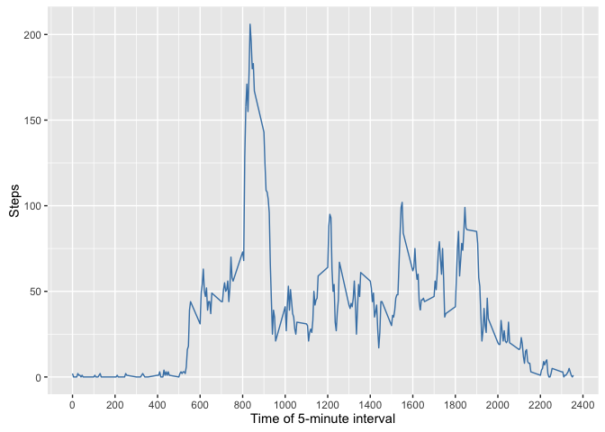
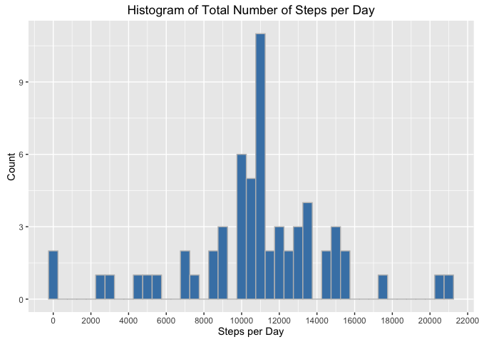
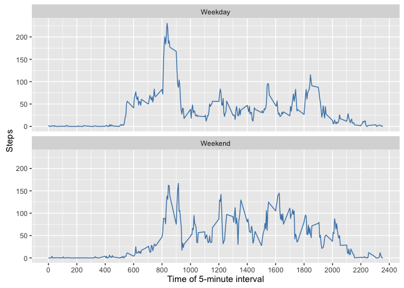

# Reproducible Research: Peer Assessment 1
### Part 1: Loading and preprocessing the data

```r
library(ggplot2)
library(dplyr)
library(lubridate)
options(scipen = 999)
act <- read.csv('/Users/bryans/data/activity.csv')
act$date <- as.Date(act$date, '%Y-%m-%d')
```
  
### Part 2: What is the mean total number of steps taken per day?
This part of the assignment will ignore the missing values in the dataset. 

1. Calculate the total number of steps taken per day. 
2. Make a histogram of the total number of steps taken each day.
3. Calculate the mean and median of the total number of steps taken per day.

The following script will calculate the total number of steps taken per day, create a new data frame called **actsteps** and will print the first ten rows of the new data set.

```r
actsteps <- group_by(act, date) %>%
    summarize(sum=sum(steps))
meanstepsperday <- round(mean(actsteps$sum, na.rm = TRUE), 2)
medianstepsperday <- median(actsteps$sum, na.rm = TRUE)
head(actsteps, 10)
```

```
## Source: local data frame [10 x 2]
## 
##          date   sum
##        (date) (int)
## 1  2012-10-01    NA
## 2  2012-10-02   126
## 3  2012-10-03 11352
## 4  2012-10-04 12116
## 5  2012-10-05 13294
## 6  2012-10-06 15420
## 7  2012-10-07 11015
## 8  2012-10-08    NA
## 9  2012-10-09 12811
## 10 2012-10-10  9900
```
  
The following plot is a histogram of the total number of steps taken each day; binwidth was set as 500 steps:  

```r
g1 <- ggplot(actsteps, aes(x = sum)) +
    geom_histogram(binwidth = 500, color = 'gray', fill='steelblue', 
                   na.rm = TRUE) +
    xlab('Steps per Day') +
    ylab('Count') +
    ggtitle('Histogram of Total Number of Steps per Day') +
    scale_x_continuous(breaks= seq(0, 22000, 2000))
g1
```

<!-- -->
  
The **mean** of the total number of steps taken per day is **10766.19**.  
The **median** of the total number of steps taken per day is **10765**.  
  
### Part 3: What is the average daily activity pattern?
1. Make a time series plot (i.e. 𝚝𝚢𝚙𝚎 = "𝚕") of the 5-minute interval (x-axis) and the average number of steps taken, averaged across all days (y-axis).
2. Which 5-minute interval, on average across all the days in the dataset, contains the maximum number of steps?
  

```r
actint <- aggregate(steps ~ interval, act, mean)
actint$steps <- round(actint$steps, 0)
actintmax <- max(actint$steps)
maxinterval <- actint$interval[which.max(actint$steps)]
```
  
The following is a time series plot of the 5-minute interval and the average number of steps taken:  
  

```r
g2 <- ggplot(actint, aes(x = interval, y = steps)) +
    geom_line(color = 'steelblue') +
    xlab('Time of 5-minute interval') +
    ylab('Steps') +
    scale_x_continuous(breaks = seq(0, 2400, 200))
g2
```

<!-- -->
  
The interval with the maximum average number of steps occurs at **835** with **206** steps.
  

### Part 4: Imputing missing values
Note that there are a number of days/intervals where there are missing values (coded as 𝙽𝙰). The presence of missing days may introduce bias into some calculations or summaries of the data.

1. Calculate and report the total number of missing values in the dataset (i.e. the total number of rows with 𝙽𝙰s)
2. Devise a strategy for filling in all of the missing values in the dataset. The strategy does not need to be sophisticated. For example, you could use the mean/median for that day, or the mean for that 5-minute interval, etc.
3. Create a new dataset that is equal to the original dataset but with the missing data filled in.
4. Make a histogram of the total number of steps taken each day and Calculate and report the mean and median total number of steps taken per day. Do these values differ from the estimates from the first part of the assignment? What is the impact of imputing missing data on the estimates of the total daily number of steps?


```r
na_count <- sum(is.na(act$steps))
```
The number of missing values in the **steps** variable of the activity dataset **act** is **2304**.  
  
To fill in the missing values in the dataset, the following script will substitute the mean value calculated for that daily interval for an **NA** at that same interval.


```r
actcopy <- act
for (i in 1:nrow(actcopy)) {
    if (is.na(actcopy[i, 1])) { 
        actcopy[i,1] <- actint$steps[actint$interval==actcopy[i, 3]]
    }
}
na_count1 <- sum(is.na(actcopy$steps))
```
To doublecheck, the **NA** count for the new data set **actcopy** is: **0**.  
  
Next, using the new data set with missing values filled in, calculate the new mean and median, and plot a histogram of the total number of steps taken each day; binwidth was set as 500 steps:  

```r
actsteps2 <- group_by(actcopy, date) %>%
    summarize(sum=sum(steps))
meanstepsperday2 <- round(mean(actsteps2$sum), 2)
medianstepsperday2 <- median(actsteps2$sum)
head(actsteps2, 10)
```

```
## Source: local data frame [10 x 2]
## 
##          date   sum
##        (date) (dbl)
## 1  2012-10-01 10762
## 2  2012-10-02   126
## 3  2012-10-03 11352
## 4  2012-10-04 12116
## 5  2012-10-05 13294
## 6  2012-10-06 15420
## 7  2012-10-07 11015
## 8  2012-10-08 10762
## 9  2012-10-09 12811
## 10 2012-10-10  9900
```

```r
g3 <- ggplot(actsteps2, aes(x = sum)) +
    geom_histogram(binwidth = 500, color = 'gray', fill='steelblue', 
                   na.rm = TRUE) +
    xlab('Steps per Day') +
    ylab('Count') +
    ggtitle('Histogram of Total Number of Steps per Day') +
    scale_x_continuous(breaks= seq(0, 22000, 2000))
g3
```

<!-- -->
  
The new **mean** of the total number of steps taken per day is **10765.64**.  
The new **median** of the total number of steps taken per day is **10762**.  
The impact of imputing the missing data values turns out to be minimal, as the original cacluated mean value was **10766.19** and the median was **10765**.

### Part 5: Are there differences in activity patterns between weekdays and weekends?
For this part the 𝚠𝚎𝚎𝚔𝚍𝚊𝚢𝚜() function may be of some help here. Use the dataset with the filled-in missing values for this part.

1. Create a new factor variable in the dataset with two levels – “weekday” and “weekend” indicating whether a given date is a weekday or weekend day.
2. Make a panel plot containing a time series plot (i.e. 𝚝𝚢𝚙𝚎 = "𝚕") of the 5-minute interval (x-axis) and the average number of steps taken, averaged across all weekday days or weekend days (y-axis). See the README file in the GitHub repository to see an example of what this plot should look like using simulated data.

The following script will create the new factor variable **weekday** in the data set **actcopy** indicating if the day of the week is a weekday or weekend day.

```r
actcopy$weekday <- weekdays(actcopy$date)
actcopy$weekday <- ifelse(actcopy$weekday == 'Saturday' |
                              actcopy$weekday == 'Sunday',
                          actcopy$weekday <- 'Weekend',
                          actcopy$weekday <- 'Weekday')
actcopy$weekday <- as.factor(actcopy$weekday)
```


Next, the requested panel plot of interval (x-axis) v. average number of steps (y-axis) for weekend and weekday days:

```r
actcopyint <- aggregate(steps ~ interval + weekday, actcopy, mean)
g4 <- ggplot(actcopyint, aes(x = interval, y = steps, color = weekday)) +
    facet_wrap(~ weekday, nrow = 2, ncol = 1) +
    geom_line(color = 'steelblue') +
    xlab('Time of 5-minute interval') +
    ylab('Steps') +
    scale_x_continuous(breaks = seq(0, 2400, 200))
g4
```

<!-- -->


